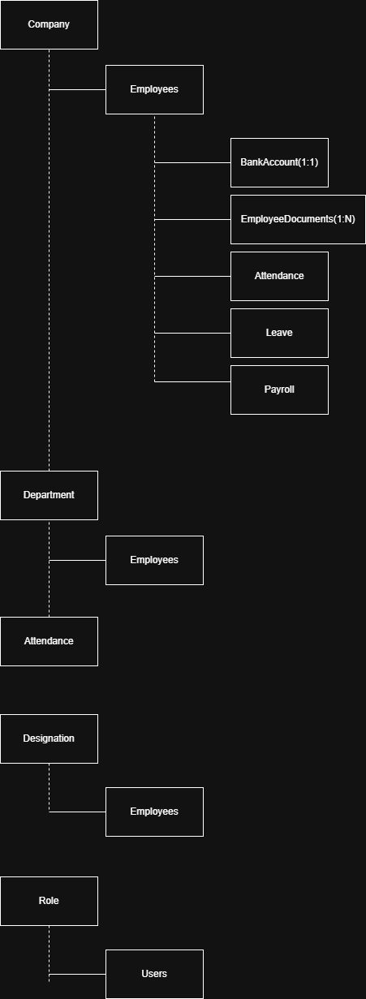

# Database Design

## Entities

- Company
- User
- Role
- Employee
- Department
- Designation
- Attendance
- Leave
- Holiday
- Payroll
- SalaryComponent
- Payslip
- BankAccount
- EmployeeDocument

## Relationships

| Relationship            | Type        |
| ----------------------- | ----------- |
| Company → Employees     | One-to-Many |
| Department → Employees  | One-to-Many |
| Designation → Employees | One-to-Many |
| Employee → Attendance   | One-to-Many |
| Employee → Leave        | One-to-Many |
| Employee → Payroll      | One-to-Many |
| Employee → Documents    | One-to-Many |
| Employee → BankAccount  | One-to-One  |
| Role → Users            | One-to-Many |

## ER Diagram

## Tables

## Relationships

## Naming Convention

## Indexing Strategy

## Migration Rules

## Design Decisions

### Soft Deletes

Business entities support `deletedAt` to allow recovery of accidentally deleted data.

### Indexing

Indexes added to frequently searched fields.

### Address Storage

Structured address fields replace a single address column.

### Department Codes

Departments use short unique codes for reporting.

## Multi-Tenant Strategy

Tenant = Company

Rules:

- Every business table contains companyId.
- Authentication resolves the current company.
- Queries are always filtered by companyId.
- Cross-company access is prohibited.

## Employee Domain

### Employee

Stores employee master data.

### BankAccount

One primary bank account per employee.

Future enhancement:
- Multiple accounts
- Salary account history

### EmployeeDocument

Stores metadata for uploaded files.

Actual files are stored in Supabase Storage.

## Attendance

Purpose:
Stores one attendance record per employee per working day.

Rules:
- One record per employee per date.
- Stores working minutes.
- Stores overtime separately.
- Supports remarks.
- Belongs to one company.

Indexes:
- employeeId
- attendanceDate
- status
- companyId

## Leave Module

### LeaveType

Defines leave policies.

### LeaveRequest

Stores leave applications.

### LeaveBalance

Stores yearly balances.

Rules:

- Leave balance is maintained separately.
- Leave requests update balances after approval.

## Audit Fields

Future enhancement:

- createdByUserId
- updatedByUserId
- deletedByUserId

These fields will reference the User table and improve traceability.

## Database Design Principles

- Normalize master data.
- Separate transactional data.
- Prefer enums over free text.
- Store file URLs, not files.
- Use soft deletes.
- Use indexes for common queries.
- Support multi-tenancy.
- Keep audit information.

## Payroll Domain

### SalaryStructure

Defines employee compensation.

### SalaryComponent

Defines reusable earnings and deductions.

### PayrollRun

Represents one payroll cycle.

### PayrollItem

Stores payroll results for one employee.

### Payslip

Stores generated payslip metadata.

### Design Principles

- Payroll is immutable after locking.
- Attendance is the source of truth.
- Leave affects payroll only after approval.
- Calculations are stored, not recomputed.

## Salary Components

Salary components are configurable.

Examples:

- Basic
- HRA
- PF
- ESIC
- Bonus

Each company defines its own components.

## Salary Structure

Stores the assigned salary components for each employee.

Supports:

- Effective dates
- Salary revisions
- Unlimited components

## PayrollRun

Represents one payroll processing cycle.

Rules:

- One payroll run per company per month.
- Payroll progresses through:
  Draft → Calculated → Approved → Locked.

## PayrollItem

Stores payroll results for one employee.

Rules:

- Snapshot of calculated values.
- Never recalculate historical payroll.
- One payroll item per employee per payroll run.

## PayrollItemComponent

Stores the detailed earnings and deductions for one employee's payroll.

Design Principles:

- Snapshot component names.
- Snapshot calculation types.
- Preserve historical payroll.
- One PayrollItem contains many PayrollItemComponents.